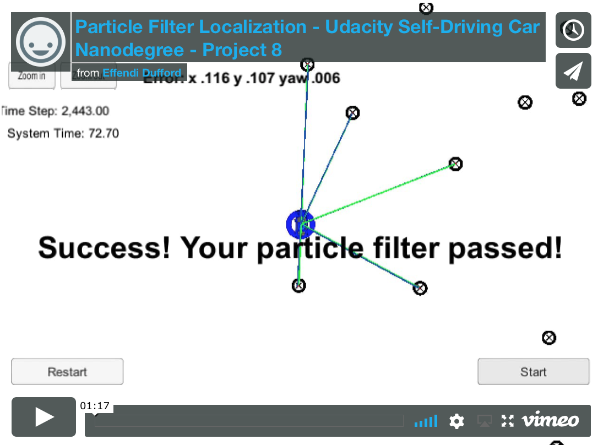

# **Particle Filter Localization - Kidnapped Vehicle Project**

**Udacity Self Driving Car Nanodegree - Project #8**

2017/10/3

## Overview

This project implements a **particle filter** algorithm to **localize a vehicle using map landmarks** to achieve higher positional precision than raw GPS.

The algorithm follows the following steps:

1. Initialize the filter's particles by **randomly sampling from a Gaussian distribution** around the initial GPS position and orientation [x, y, and theta].
2. After the vehicle moves for timestep dt with a known **control velocity and yaw rate**, use CTRV motion equations to **predict the position of the particles** and add **additional Gaussian uncertainty** around these predicted particle positions and orientations.
3. For each particle position, **pre-filter map landmarks** that are within sensor range and **match each of the vehicle's measured observations (RADAR/LIDAR range finding) to the nearest map landmark**.
4. Set each particle's weight by the **multivariate Gaussian probability** of how the measured observation [x, y] position matches the associated map landmark [x, y] position for each of the measured observations, multiplying them all together to get the **total particle weight** value.
5. **Resample** the set of particles with the **probability based on the particle weights** to recenter them on the best matches from the landmark observations.
6. Visualize the **best particle with the highest weight** and it's associated observations as the filter's output vehicle position.

## Key Files

| File                         | Description                                                                                                                                            |
|:----------------------------:|:------------------------------------------------------------------------------------------------------------------------------------------------------:|
| /src/main.cpp                | Source code for **main loop** that handles **uWebSockets communication to simulator**                                                                  |
| /src/particle_filter.cpp, .h | Source code for **particle filter algorithm** that localizes vehicle position by sampling particles that best match measured map landmark observations |
| /build/particle_filter       | Output **executable program binary**                                                                                                                   |
| install-mac.sh               | Script for Mac to install uWebSocketIO required to interface with simulator                                                                            |
| install-ubuntu.sh            | Script for Linux to install uWebSocketIO required to interface with simulator                                                                          |

The original Udacity project repository is [here](https://github.com/udacity/CarND-Kidnapped-Vehicle-Project).

## How to Build and Run Code

This project involves the Udacity Term 2 Simulator which can be downloaded [here](https://github.com/udacity/self-driving-car-sim/releases)

This repository includes two scripts (**install-mac.sh** and **install-ubuntu.sh**) that can be used to set up and install [uWebSocketIO](https://github.com/uWebSockets/uWebSockets) for either Linux or Mac systems.

Once the install for uWebSocketIO is complete, the main program can be built and run by doing the following from the project top directory.

1. mkdir build
2. cd build
3. cmake ..
4. make
5. ./particle_filter

If using Xcode to build, run the following commands:

1. mkdir xbuild
2. cd xbuild
3. cmake -G "Xcode" ..
4. copy /data/map_data.txt to /xbuild/data/map_data.txt
4. Open "PARTICLE_FILTER.xcodeproj" in Xcode and build
5. cd Debug
6. ./particle_filter

## Other Important Dependencies

* cmake >= 3.5
  * All OSes: [click here for installation instructions](https://cmake.org/install/)
* make >= 4.1 (Linux, Mac), 3.81 (Windows)
  * Linux: make is installed by default on most Linux distros
  * Mac: [install Xcode command line tools to get make](https://developer.apple.com/xcode/features/)
  * Windows: [Click here for installation instructions](http://gnuwin32.sourceforge.net/packages/make.htm)
* gcc/g++ >= 5.4
  * Linux: gcc / g++ is installed by default on most Linux distros
  * Mac: same deal as make - [install Xcode command line tools](https://developer.apple.com/xcode/features/)
  * Windows: recommend using [MinGW](http://www.mingw.org/)

## Communication protocol between uWebSocketIO and Simulator

**INPUT to main.cpp**: values provided by the simulator to the C++ program

* ["sense_x"] => GPS measured x position (noisy)
* ["sense_y"] => GPS measured y position (noisy)
* ["sense_theta"] => GPS measured orientation theta (noisy)
* ["previous_velocity"] => control velocity of vehicle for previous dt timestep
* ["previous_yawrate"] => control yaw rate of vehicle for previous dt timestep
* ["sense_observations_x"] => measured landmark x position observation (RADAR/LIDAR)
* ["sense_observations_y"] => measured landmark y position observation (RADAR/LIDAR)

**OUTPUT from main.cpp**: values provided by the C++ program to the simulator

* ["best_particle_x"] <= particle filter estimated x position
* ["best_particle_y"] <= particle filter estimated y position
* ["best_particle_theta"] <= particle filter estimated orientation theta
* ["best_particle_associations"] <= visualization list of best particle's associated landmark IDs
* ["best_particle_sense_x"] <= visualization list of best particle's associated landmark x positions
* ["best_particle_sense_y"] <= visualization list of best particle's associated landmark y positions
